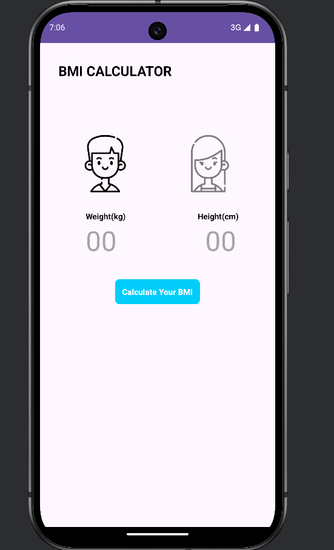
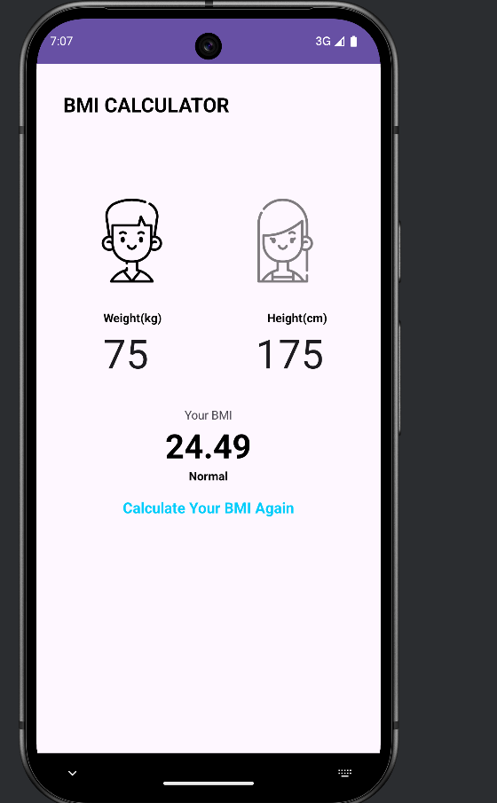
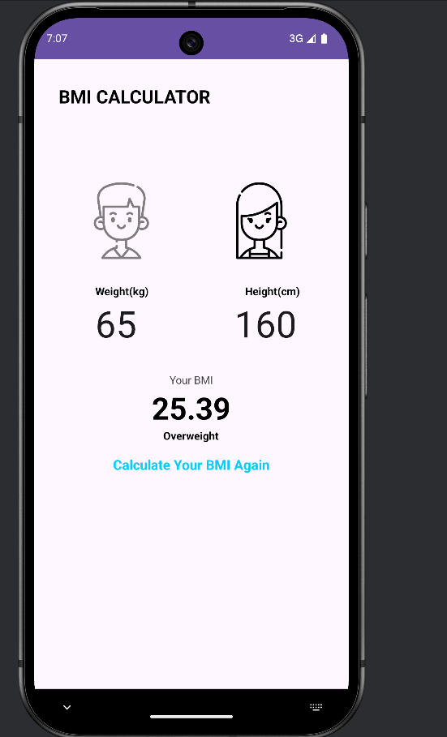

<h1 align="center">📱 BMI Calculator - Android (Kotlin)</h1>

<p align="center">
  A simple and modern <b>BMI Calculator</b> built with Kotlin for Android, helping users check their Body Mass Index and stay fit.  
</p>

---

## 🛠️ Tech Stack


---

## ✨ Features

| Feature | Description |
|---------|-------------|
| ⚡ Instant BMI Calculation | Enter height & weight, get BMI instantly |
| 📏 Metric Units | Supports kg and cm inputs |
| 🎨 Clean UI | Minimal and modern Android design |
| 🏷️ BMI Classification | Underweight, Normal, Overweight, Obese |
| 📊 Clear Results | Easy-to-read categories with health ranges |
| 🔌 Offline Support | Works fully offline |

---

## 📱 Screenshots

<p align="center">
  
  
  
</p>

---

## 🚀 Installation

1. Clone the repository  
   ```bash
   git clone https://github.com/ErenYeager2004/BMI-Calculator.git

## 🚀 Getting Started

1. Open the project in **Android Studio**  
2. Let **Gradle sync** the dependencies  
3. Run on an **emulator** or **physical Android device**  

---

## 🎯 Usage

1. Enter your **Height (cm)** and **Weight (kg)**  
2. Tap **Calculate BMI**  
3. Instantly see:  
   - ✅ Your BMI value  
   - ✅ Health classification *(Underweight, Normal, Overweight, Obese)*  

---

## 📚 BMI Categories Reference

| Category        | BMI Range       |
|-----------------|-----------------|
| Underweight     | < 18.5          |
| Normal Weight   | 18.5 – 24.9     |
| Overweight      | 25 – 29.9       |
| Obese           | ≥ 30            |

---

## 🤝 Contributing

Contributions are welcome!  
Feel free to **fork** this repo and submit a **pull request** with improvements.  

---

## 📄 License

This project is licensed under the **MIT License** – see the [LICENSE](LICENSE) file for details.  

---

<p align="center">🔥 Developed with ❤️ in Kotlin</p>

